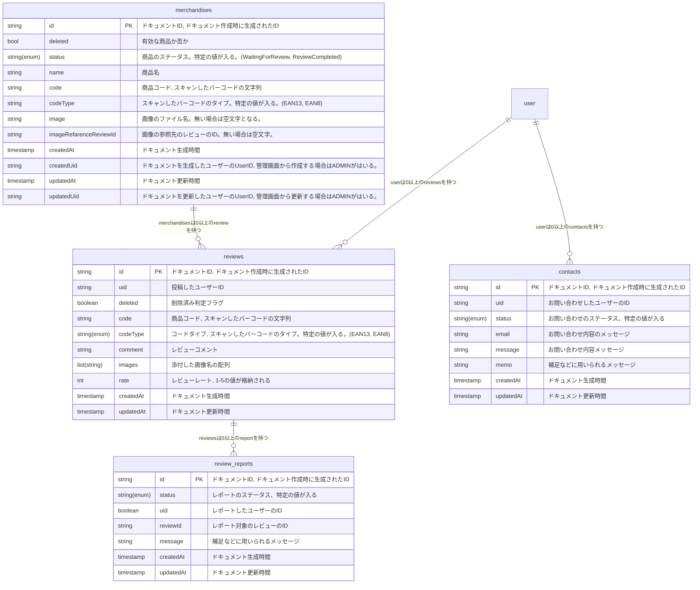
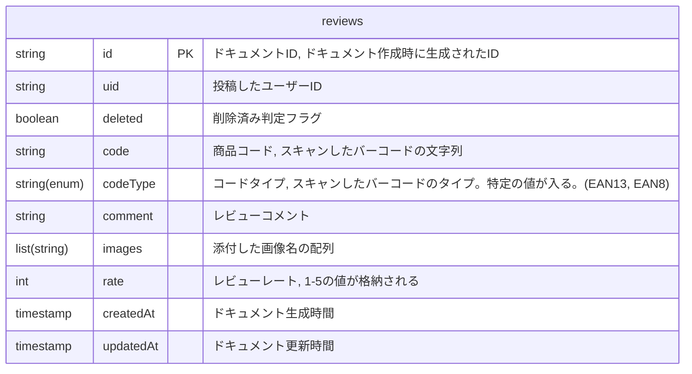
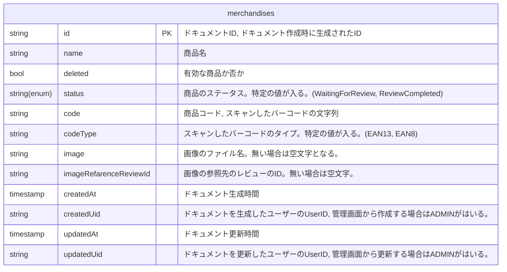
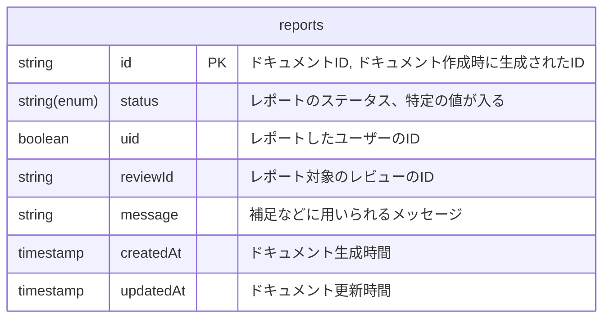
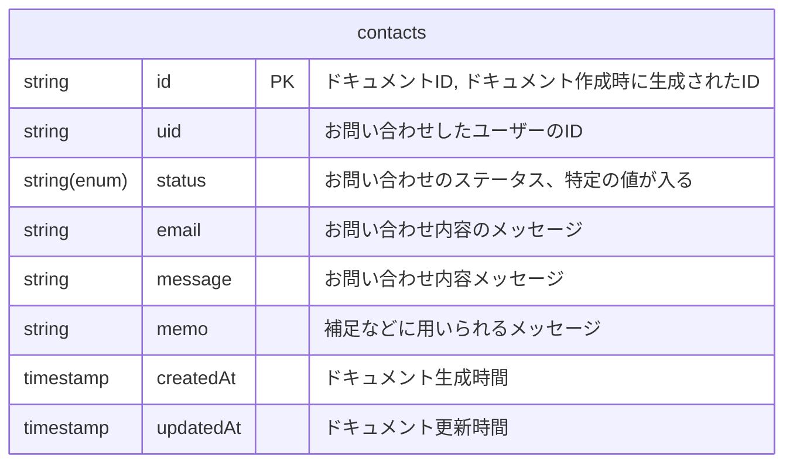

# Database

データベースについてのドキュメントです。
reviewers のデータベースには Firestore を利用しています。
Firestoreのルール については [Firestoreルール](firestore-rule.md) にまとめてあります。

## Relation

## reviews

商品レビューが格納されるコレクションです。

codeType には以下のいずれかの値が入ります。
- EAN13
- EAN8

## merchandises

食品の情報が格納されるコレクションです。

## reports
報告が格納されるコレクション

## contacts

### uid: string
ドキュメントID, ドキュメント作成時に生成されたID

### status: string(enum)
`xxx`, `yyy` のいずれかの値を持つ
