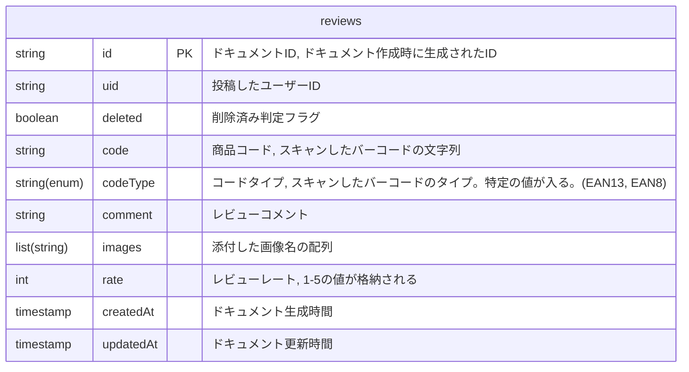
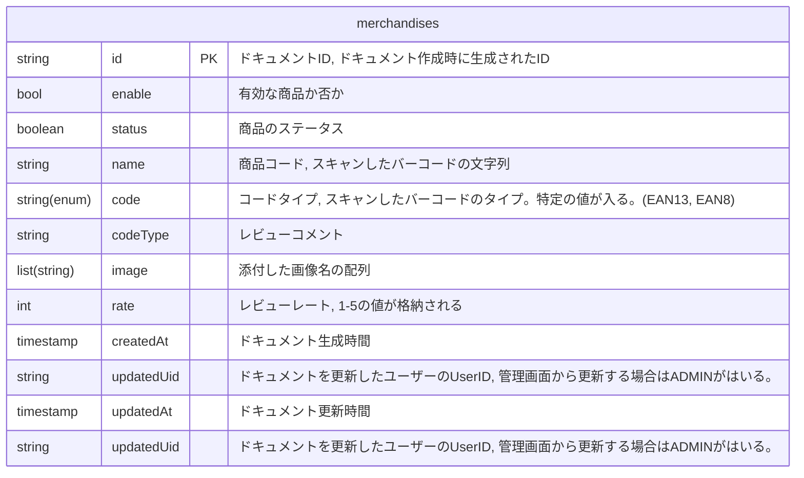
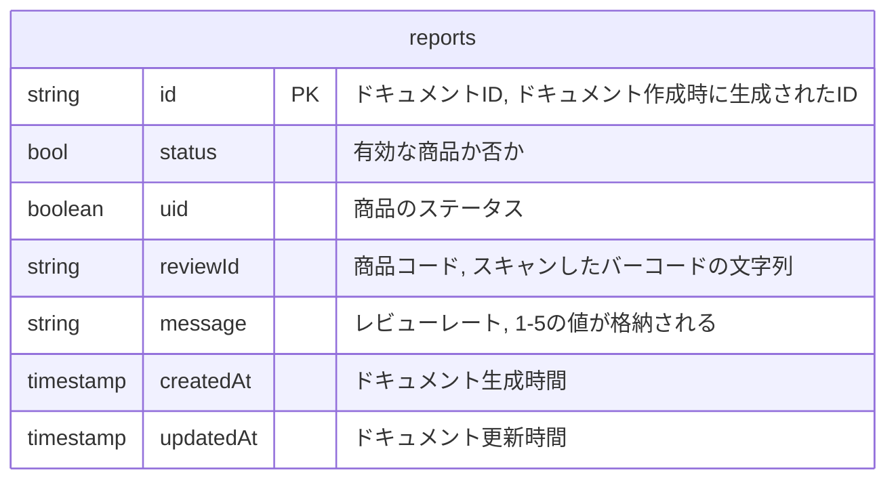

# Database
データベースについてのドキュメントです。
レビュワーズのデータベースには Firestore を利用しています。


## reviews

レビューが格納されるコレクション




## merchandises

食品の情報が格納されるコレクション



```
        && 'enable' in merchandise && merchandise.enable is bool
        && 'status' in merchandise && merchandise.status is string
        && 'name' in merchandise && merchandise.name is string
        && 'code' in merchandise && merchandise.code is string
        && 'codeType' in merchandise && merchandise.codeType is string
        && 'image' in merchandise && merchandise.image is string
        && 'imageRefarenceReviewId' in merchandise && merchandise.imageRefarenceReviewId is string
        && 'createdAt' in merchandise && merchandise.createdAt is timestamp
        && 'createdUid' in merchandise && merchandise.createdUid is string
        && 'updatedAt' in merchandise && merchandise.updatedAt is timestamp
        && 'updatedUid' in merchandise && merchandise.updatedUid is string;
      }
```


### createdAt: timestamp
ドキュメント生成時間

### createdUid: String
作成したユーザーのID、管理者の場合は `ADMIN` が入る

### code: string
スキャンしたバーコードの文字列

### codeType: string
スキャンしたバーコードのタイプ。以下の値が入る。
- EAN13
- EAN8

### enable: boolean
有効かどうか

### image: string
画像のファイル名。無い場合は空文字となる。

### imageReferenceReviewId: string
画像の参照先のレビューのID。無い場合は空文字。

### name: string
商品名

### status: string
ステータス。以下の値が入る。
- WaitingForReview
- ReviewCompleted

### updatedAt: timestamp
更新時の時間

### updatedUid: String
更新したユーザーのID、管理者の場合は `ADMIN` が入る。


## reports
報告が格納されるコレクション





```
        && 'status' in report && report.status is string
        && 'uid' in report && report.uid is string
        && 'reviewId' in report && report.reviewId is string
        && 'message' in report && report.message is string
        && 'createdAt' in report && report.createdAt is timestamp
        && 'updatedAt' in report && report.updatedAt is timestamp;
```
