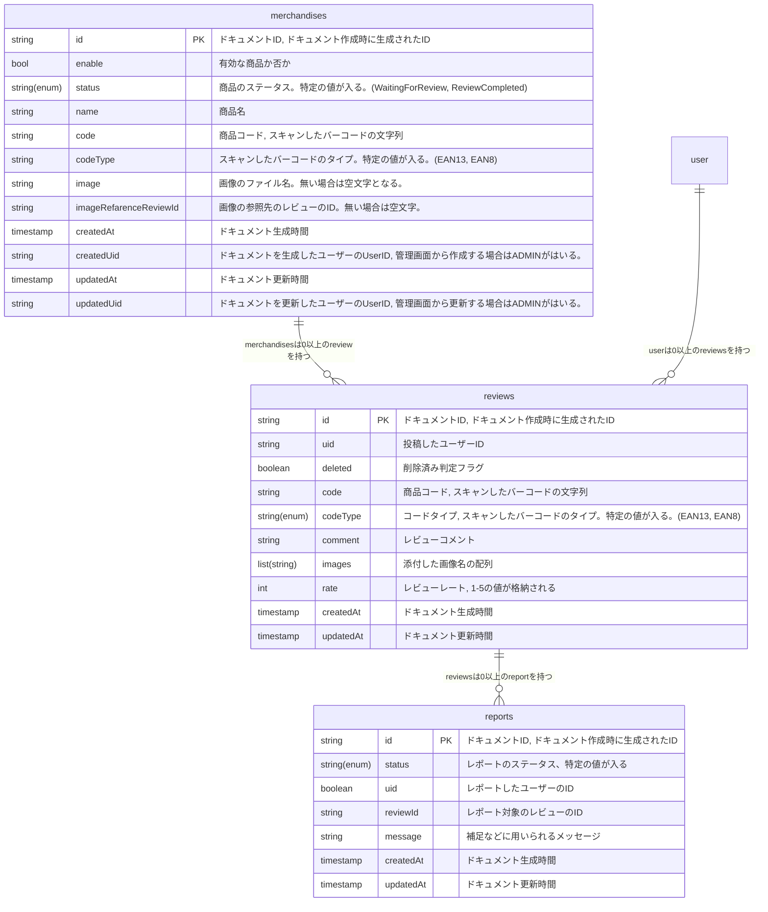
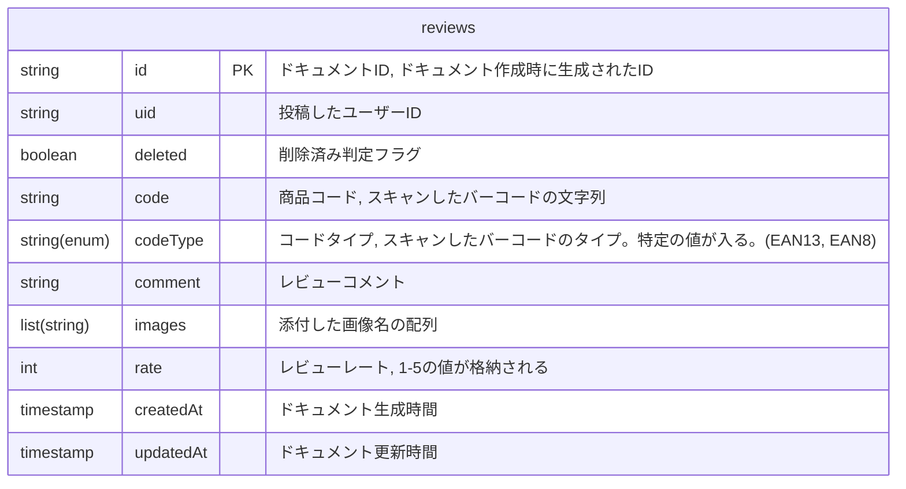
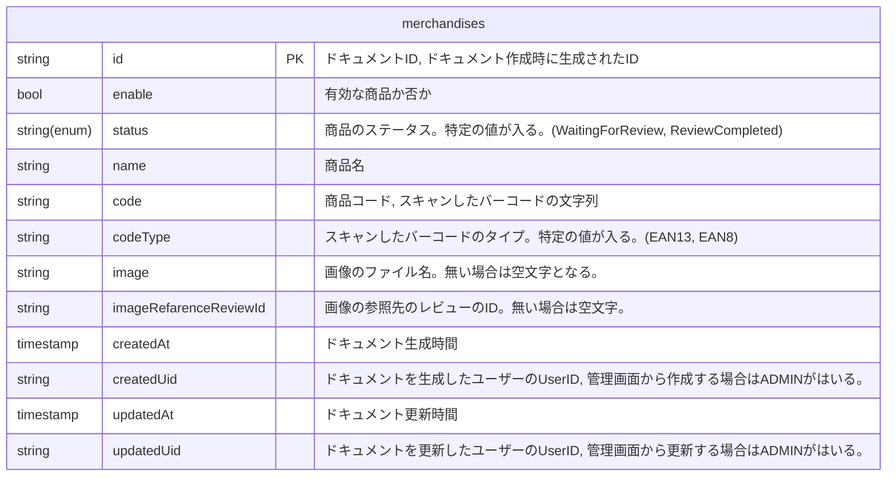
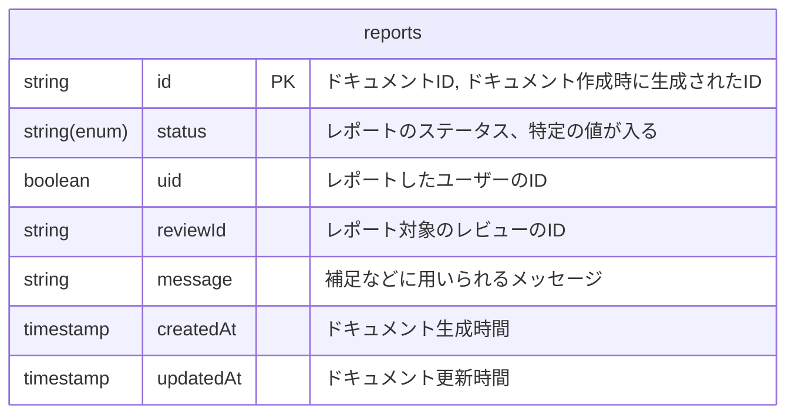

# Database
データベースについてのドキュメントです。
reviewers のデータベースには Firestore を利用しています。


## Relation




## Firestoreルール

```
rules_version = '2';

service cloud.firestore {
  match /databases/{database}/documents {
  
    ////////////////////////////////////////
    // reviews collection
    ////////////////////////////////////////
    match /reviews/{reviewId} {
      // read: 認証済みのすべてのユーザーが読み取り可能
      allow read: if request.auth != null;

			// create: 認証済み、バリデーション通過、uidが一致の場合作成可能
			allow create: if request.auth != null
      && isValidCreateReview(request.resource.data)
      && request.resource.data.uid == request.auth.uid;

			// update: 認証済み、uidが一致の場合更新可能
			allow update: if request.auth != null
      && resource.data.uid == request.auth.uid;

//       // ルールの記述
//       match /comments/{document=**} {
//         // ユーザー情報の取得のルール
//         allow read: if request.auth != null;

//         // ユーザー情報の作成のルール
//         allow write: if request.auth != null;
//       }
    }
    
    // createのバリデーション
    function isValidCreateReview(review) {
      return review.size() == 9
      && 'uid' in review && review.uid is string
      && 'deleted' in review && review.deleted is bool
      && 'code' in review && review.code is string
      && 'codeType' in review && review.codeType is string
      && 'comment' in review && review.comment is string
      && 'images' in review && review.images is list
      && 'rate' in review && review.rate is int
      && 'createdAt' in review && review.createdAt is timestamp
      && 'updatedAt' in review && review.updatedAt is timestamp;
    }


    ////////////////////////////////////////
    // profiles collection
    ////////////////////////////////////////
    match /profiles/{userId} {
      // read: 認証済みのすべてのユーザーが読み取り可能
      allow read: if request.auth != null;

			// create: 認証済み、バリデーション通過(TODO)、uidが一致の場合作成可能
			allow create: if request.auth != null
      && request.auth.uid == userId;

			// update: 認証済み、バリデーション通過、uidが一致の場合作成可能
			allow update: if request.auth != null
      && request.auth.uid == userId;
    }
    
    


    ////////////////////////////////////////
    // blocked_users collection
    ////////////////////////////////////////
    match /blocked_users/{blocked_user_id} {
      // read: 認証済みのすべてのユーザーが読み取り可能
      allow read: if request.auth != null;

			// create: 認証済み、バリデーション通過(TODO)
			allow create: if request.auth != null
      && request.auth.uid == request.resource.data.uid;
    }


    ////////////////////////////////////////
    // merchandise collection
    ////////////////////////////////////////
    match /merchandises/{merchandiseId} {
      // read: 認証済みのすべてのユーザーが読み取り可能
      allow read: if request.auth != null;

			// create: 認証済み、バリデーション通過(TODO)
			allow create: if request.auth != null
      && isValidCreateMerchandise(request.resource.data)
      && request.resource.data.createdUid == request.auth.uid
      && request.resource.data.updatedUid == request.auth.uid;
            
      // createのバリデーション
      function isValidCreateMerchandise(merchandise) {
        return merchandise.size() == 11
        && 'enable' in merchandise && merchandise.enable is bool
        && 'status' in merchandise && merchandise.status is string
        && 'name' in merchandise && merchandise.name is string
        && 'code' in merchandise && merchandise.code is string
        && 'codeType' in merchandise && merchandise.codeType is string
        && 'image' in merchandise && merchandise.image is string
        && 'imageRefarenceReviewId' in merchandise && merchandise.imageRefarenceReviewId is string
        && 'createdAt' in merchandise && merchandise.createdAt is timestamp
        && 'createdUid' in merchandise && merchandise.createdUid is string
        && 'updatedAt' in merchandise && merchandise.updatedAt is timestamp
        && 'updatedUid' in merchandise && merchandise.updatedUid is string;
      }
    }
    

    ////////////////////////////////////////
    // report collection
    ////////////////////////////////////////
    match /reports/{reportId} {
      // read: 認証済みのすべてのユーザーが読み取り可能
      allow read: if request.auth != null;

			// create: 認証済み、バリデーション通過(TODO)
			allow create: if request.auth != null
      && isValidCreateReport(request.resource.data)
      && request.resource.data.uid == request.auth.uid;
            
      // createのバリデーション
      function isValidCreateReport(report) {
        return report.size() == 6
        && 'status' in report && report.status is string
        && 'uid' in report && report.uid is string
        && 'reviewId' in report && report.reviewId is string
        && 'message' in report && report.message is string
        && 'createdAt' in report && report.createdAt is timestamp
        && 'updatedAt' in report && report.updatedAt is timestamp;
      }
    }    
  }
}
```


## reviews

商品レビューが格納されるコレクションです。



codeType には以下のいずれかの値が入ります。
- EAN13
- EAN8


## merchandises

食品の情報が格納されるコレクションです。




## reports
報告が格納されるコレクション



