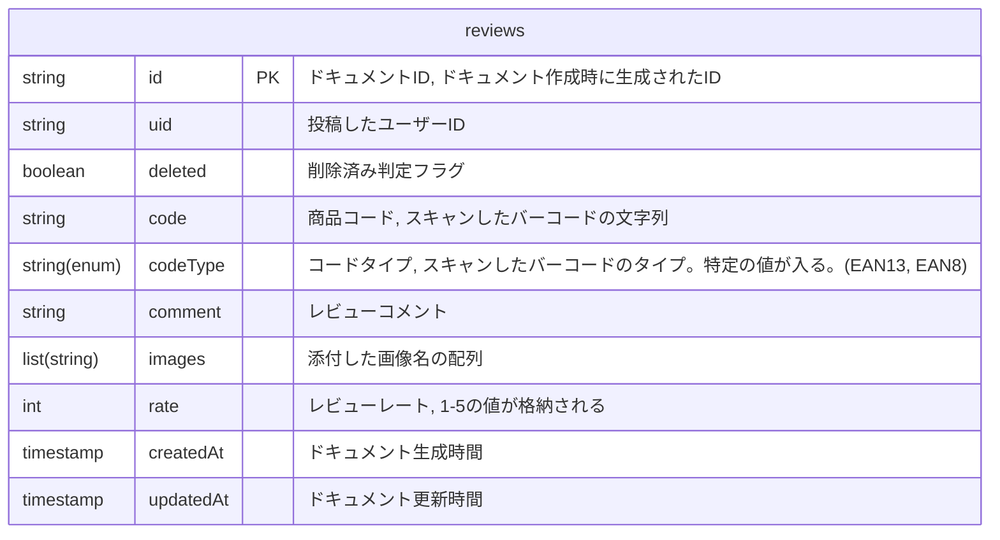
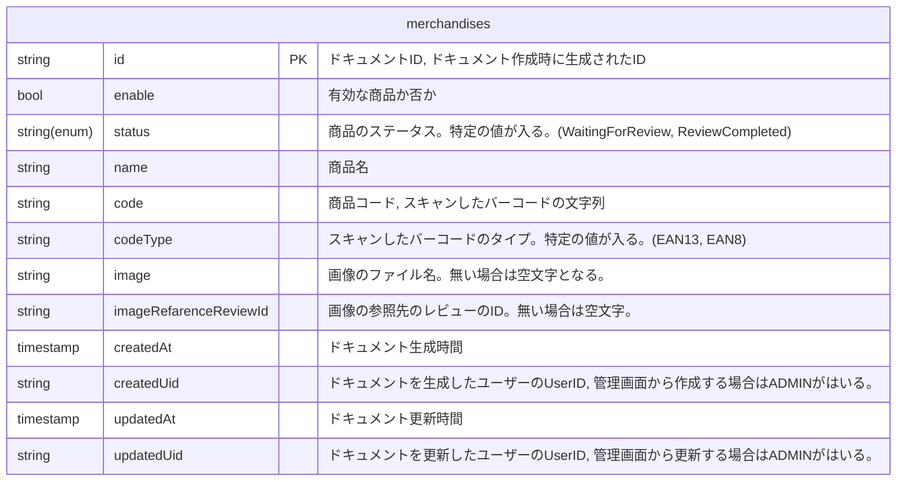
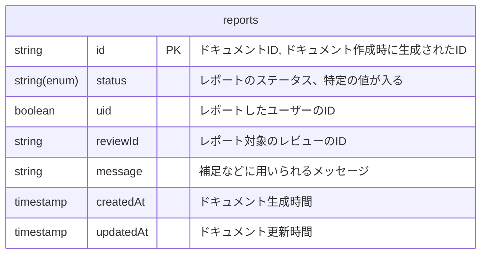

# Database
データベースについてのドキュメントです。
レビュワーズのデータベースには Firestore を利用しています。

## reviews

レビューが格納されるコレクション

```mermaid
erDiagram
  reviews {
    string id PK "ドキュメントID, ドキュメント作成時に生成されたID"
    string uid "投稿したユーザーID"
    boolean deleted "削除済み判定フラグ"
    string code "商品コード, スキャンしたバーコードの文字列"
    string(enum) codeType "コードタイプ, スキャンしたバーコードのタイプ。特定の値が入る。(EAN13, EAN8)"
    string comment "レビューコメント"
    list(string) images "添付した画像名の配列"
    int rate "レビューレート, 1-5の値が格納される"
    timestamp createdAt "ドキュメント生成時間"
    timestamp updatedAt "ドキュメント更新時間"
}
```

## merchandises

食品の情報が格納されるコレクション

```mermaid
erDiagram
  merchandises {
    string id PK "ドキュメントID, ドキュメント作成時に生成されたID"
    bool enable "有効な商品か否か"
    string(enum) status "商品のステータス。特定の値が入る。(WaitingForReview, ReviewCompleted)"
    string name "商品名"
    string code "商品コード, スキャンしたバーコードの文字列"
    string codeType "スキャンしたバーコードのタイプ。特定の値が入る。(EAN13, EAN8)"
    string image "画像のファイル名。無い場合は空文字となる。"
    string imageRefarenceReviewId "画像の参照先のレビューのID。無い場合は空文字。"
    timestamp createdAt "ドキュメント生成時間"
    string createdUid "ドキュメントを生成したユーザーのUserID, 管理画面から作成する場合はADMINがはいる。"
    timestamp updatedAt "ドキュメント更新時間"
    string updatedUid "ドキュメントを更新したユーザーのUserID, 管理画面から更新する場合はADMINがはいる。"
}
```

## reports
報告が格納されるコレクション

```mermaid
erDiagram
  reports {
    string id PK "ドキュメントID, ドキュメント作成時に生成されたID"
    string(enum) status "レポートのステータス、特定の値が入る"
    boolean uid "レポートしたユーザーのID"
    string reviewId "レポート対象のレビューのID"
    string message "補足などに用いられるメッセージ"
    timestamp createdAt "ドキュメント生成時間"
    timestamp updatedAt "ドキュメント更新時間"
}
```
